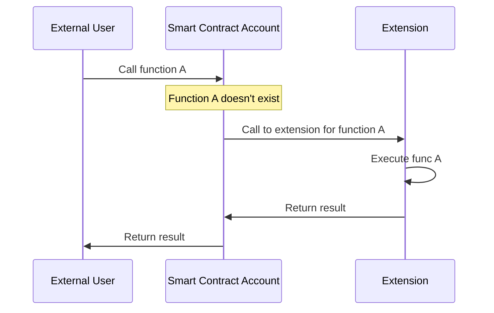

# Contract Extensions

This repository contains smart contract **extensions** to be used with different smart contracts accounts, similar to those used in advanced account systems like **Gnosis Safe** and **Universal Profiles**, etc ..

## Overview

Smart contract accounts often implement an extending mechanism where calls to non-existent functions are delegated to extensions using the fallback function. These extensions contain the actual logic and execute it on behalf of the main contract.



This approach is beneficial for contracts that:

* Have logic that may change over time
* Need to implement a large number of functions
* Want to maintain upgradeability for specific functionalities

## Use Cases

### Flexible ERC721 Callbacks

Consider an ERC721 token receiver. Initially, in your **GnosisSafe/UniversalProfile** you might want to accept all tokens. However, later you may decide to only accept specific tokens. If this logic was implemented natively in an immutable contract, changing it would be impossible. By using extensions, you can:

* Start with an extension that accepts all tokens
* Later, replace it with a new extension that only accepts specific tokens

This flexibility allows for evolving logic without needing to redeploy the main contract.

## Available Extensions

The extensions available are:
- `ExtERC165StorageOwnable`: Extension that allows the owner of the extension to add **ERC165** supported interfaces.
- `ExtERC165StorageSingleton`: Extension that allows each smart contract account to add **ERC165** supported interfaces, can be used as a singleton.
- `ExtERC1271Ownable`: Extension that validates the signature and the hash based on whether the recovered address matches the address of the owner of the smart contract account.
  
More to come soon ...

## Usage

### Build

```sh
$ forge build
```

### Test

```sh
$ forge test
```

### Gas Snapshots

```sh
$ forge snapshot
```

## Contributing

Contributions are welcome! Please feel free to submit a Pull Request.

## License

[MIT License](LICENSE)
